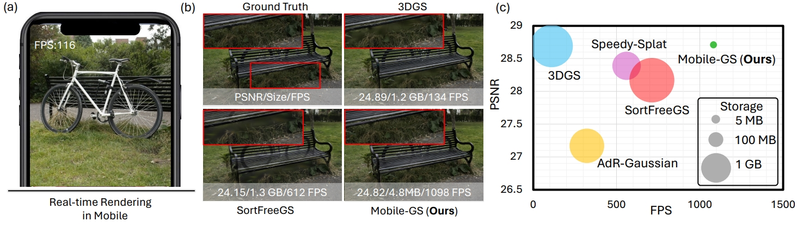

<h2 align="center"> <a href="https://xiaobiaodu.github.io/mobile-gs-project/">Mobile-GS: Real-time Gaussian Splatting for Mobile Devices</a></h2>
<h5 align="center"> If you like our project, please give us a star ⭐ on GitHub for latest update.  </h2>

<h5 align="center">

[](https://xiaobiaodu.github.io/mobile-gs-project/)
[](https://arxiv.org/abs/2603.11531)


## 😮 Highlights




## 🚩 **Updates**

Welcome to **watch** 👀 this repository for the latest updates.

✅ **[2026.3.21]** : We only release the initial CUDA version for readers to bettet understand our work. As for mobile-side Vulkan code, we cannot release this part of code due to the company's policy.

✅ **[2026.3.13]** : Release [project page](https://xiaobiaodu.github.io/mobile-gs-project/).

✅ **[2026.3.13]** : Code Release. 


## Setup

For installation:
We recommend to use cuda 11.8 with python 3.11 for easy setup.
```shell
git clone git@github.com:xiaobiaodu/Mobile-GS.git

conda create -n mobile-gs python==3.11
conda activate mobile-gs

pip install torch==2.5.1 torchvision==0.20.1 torchaudio==2.5.1 --index-url https://download.pytorch.org/whl/cu118
pip install -r requirements.txt
```
#### Install [TMC (GPCC)](https://github.com/MPEGGroup/mpeg-pcc-tmc13), and add tmc3 to your environment variable or manually specify its location in [the code](https://github.com/maincold2/OMG/blob/main/utils/gpcc_utils.py) (lines 243 and 258, this script is sourced from [HAC++](https://github.com/YihangChen-ee/HAC-plus)).
If you have trouble in installing cuml, please refer to the [CUML Installation Guide](https://docs.rapids.ai/install/).

We used [Mip-NeRF 360](https://jonbarron.info/mipnerf360/), [Tanks & Temples, and Deep Blending](https://repo-sam.inria.fr/fungraph/3d-gaussian-splatting/datasets/input/tandt_db.zip).

## Running

### Pre-training (Mini-Splatting)

```shell
#for outdoor scenes (e.g., Mip-NeRF 360 outdoor and T&T scenes)
python pretrain.py -s <path to COLMAP>  -m  <model path> --eval --imp_metric outdoor --sh_degree 3   --iterations 30000
#for indoor scenes (e.g., Mip-NeRF 360 indoor and DB scenes)
python pretrain.py -s <path to COLMAP>  -m  <model path> --eval --imp_metric indoor --sh_degree 3   --iterations 30000

```

### Fine-tune
```shell
python train.py -s  <path to COLMAP> -m <model path>  --eval --start_checkpoint  <model path>/chkpnt30000.pth 

# To improve rendering perofmrance, you can use multi-view training from MVGS. It may cause longer training time and memory.
python train.py -s  <path to COLMAP> -m <model path>  --eval --start_checkpoint  <model path>/chkpnt30000.pth   --mv  3
```

## Evaluation
```shell
python render.py -s <path to COLMAP> -m <model path> --decode
python metrics.py -m <model path> 
```
#### --decode
Rendering with the compressed file (comp.xz), otherwise using the ply file. The results are the same regardless of this option.


## 👍 **Acknowledgement**
This work is built on many amazing research works and open-source projects, thanks a lot to all the authors for sharing!
* [Mini-Splatting](https://github.com/fatPeter/mini-splatting)
* [OMG](https://github.com/maincold2/OMG)
* [MVGS](https://github.com/xiaobiaodu/MVGS)


## BibTeX
```
@misc{du2026mobile-gs,
      title={Mobile-GS: Real-time Gaussian Splatting for Mobile Devices}, 
      author={Xiaobiao Du and Yida Wang and Kun Zhan and Xin Yu},
      year={2026},
      eprint={2603.11531},
      archivePrefix={arXiv},
      primaryClass={cs.CV},
      url={https://arxiv.org/abs/2603.11531}, 
}
```
